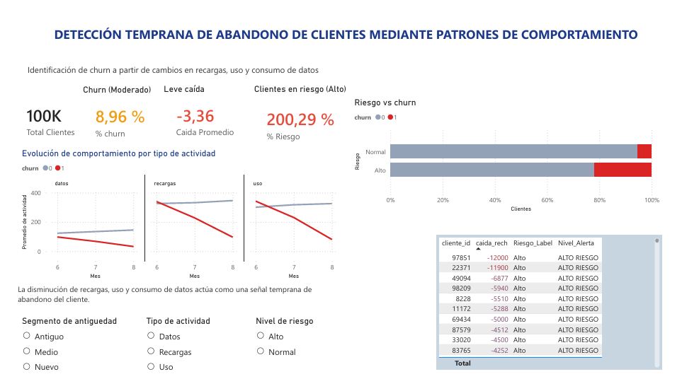

# 📉 Análisis de Churn — Empresa de Telecomunicaciones

> Proyecto de análisis y predicción del abandono de clientes basado en patrones de uso, recargas y consumo de datos móviles en los meses previos al abandono.

---

## 📌 Descripción del Proyecto

Este proyecto analiza el comportamiento de clientes de una empresa de telecomunicaciones para identificar los factores que llevan al **abandono (churn)**. Se estudian variables como recargas, minutos de llamadas y consumo de datos móviles (2G/3G) durante los meses 6 al 9, buscando detectar señales tempranas de abandono antes de que ocurra.

El churn se define como actividad **cero en el mes 9** en todas las variables clave. El flujo de trabajo incluye limpieza de datos, análisis exploratorio, feature engineering, y un **modelo predictivo de Regresión Logística** capaz de detectar más del 90% de los clientes en riesgo.

---

## 🗂️ Estructura del Proyecto

```
telecom-churn-analysis/
│
├── data/
│   ├── telecom_churn_data/     # Datos originales sin procesar
│   └── clean_churn/            # Datos limpios listos para análisis
│
├── notebook/
│   └── 01_limpieza.ipynb     # Limpieza, análisis exploratorio (EDA) y modelo predictivo
│  
│
├── excel/
│   └── analisis_churn.xlsx   # Análisis complementario en Excel
│
├── images/
│   └── dashboard_churn.png  # Imagen del dashboard 
│
├── powerbi/
│   └── telecom-customer-churn.pbix  # Dashboard interactivo en Power BI
└── README.md
```

---

## 🔍 Fases del Análisis

### 1. 🧹 Limpieza de Datos
- Selección de columnas relevantes: ARPU, recargas, llamadas (MOU), datos 2G/3G y antigüedad (`aon`)
- Tratamiento de valores nulos y duplicados
- Estadísticas descriptivas para validar la calidad del dataset

### 2. 📊 Análisis Exploratorio (EDA)
- Distribución del churn: ~91% clientes activos vs ~9% churn (clases desbalanceadas)
- Evolución de recargas, llamadas y datos 2G/3G por grupo (churn vs no churn) en meses 6-8
- **Insight clave:** Los clientes en riesgo muestran una caída progresiva en toda su actividad antes de abandonar
- La antigüedad (`aon`) no muestra diferencia significativa entre ambos grupos

### 3. ⚙️ Feature Engineering
- `caida_rech` = `total_rech_amt_8 - total_rech_amt_6`: mide la caída en recargas en los 3 meses previos al churn
- Clientes con `caida_rech < -150` presentan **más de 4 veces** la probabilidad de churn
- Esta variable se convierte en la señal de alerta temprana más poderosa del modelo

### 4. 🤖 Modelo Predictivo
- **Algoritmo:** Logistic Regression con `class_weight="balanced"` para manejar el desbalance de clases
- División train/test (80/20) con `random_state=42`
- Ajuste de threshold de 0.5 → **0.3** para priorizar recall (detección de clientes en riesgo)
- **Resultado:** El modelo detecta más del **90% de los clientes que abandonan el servicio**
- Métricas evaluadas: Accuracy, Recall, F1-Score y classification report

### 5. 📈 Análisis en Excel
- Tablas dinámicas por segmento y tipo de plan
- Comparativas de uso entre clientes activos vs. churn

### 6. 📊 Dashboard en Power BI
- Visualización de KPIs de churn
- Segmentación interactiva por tipo de actividad
- Evolución temporal del abandono


---

## ⚙️ Instalación y Requisitos

### Requisitos previos
- Python 3.8 o superior
- [VS Code](https://code.visualstudio.com/) (recomendado para abrir los notebooks)
- Power BI Desktop (para el dashboard `.pbix`)
- Microsoft Excel (para el análisis `.xlsx`)

### Extensiones de VS Code

Para ejecutar los notebooks `.ipynb` instala estas dos extensiones:

- [Python](https://marketplace.visualstudio.com/items?itemName=ms-python.python)
- [Jupyter](https://marketplace.visualstudio.com/items?itemName=ms-toolsai.jupyter)

### Clonar el repositorio

```bash
git clone https://github.com/tu-usuario/telecom-churn-analysis.git
cd telecom-churn-analysis
```

**Librerías utilizadas:**

```txt
pandas
matplotlib
seaborn
scikit-learn
jupyter
```

---

## 📊 Resultados Destacados

| Métrica        | Valor (threshold=0.3)  |
|----------------|------------------------|
| Recall (churn) | 91.3%                  |
| Accuracy       | 57.4%                  |
| F1-Score       | 0.28%                  |


**Variables con mayor impacto en el churn:**
- `caida_rech` — caída en recargas entre mes 6 y mes 8 (señal más predictiva)
- `total_rech_amt_6/7/8` — nivel y tendencia de recargas
- `total_og_mou_6/7/8` — minutos de llamadas salientes
- `vol_3g_mb_6/7/8` — consumo de datos móviles
- `aon` — antigüedad del cliente (baja relevancia predictiva)

---

## 🛠️ Tecnologías Utilizadas


---

## 👤 Autor

**Barbara Badillo**
- LinkedIn: [linkedin.com/in/barbara-badillo](https://www.linkedin.com/in/barbara-badillo/)

---

## 📄 Licencia

Este proyecto está bajo la licencia MIT. Consulta el archivo [LICENSE](LICENSE) para más detalles.
